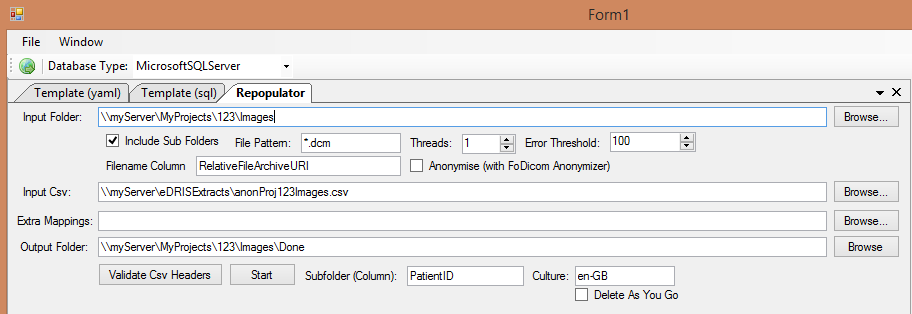
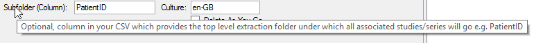
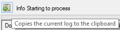

# Dicom Repopulator

## Contents

- [Background](#background)
- [Usage](#usage)
- [Saving Settings](#saving-settings)
  - [Command Line Usage](#command-line-usage)
- [Logging](#logging)
- [Matching Rows to Files](#matching-rows-to-files)
  - [Match by File Path](#match-by-file-path)
    - [File Path Formats](#file-path-formats)
  - [Match by Tag](#match-by-tag)
- [Extra Column Mappings](#extra-column-mappings)
- [Outstanding Issues](#outstanding-issues)
- [Error States](#error-states)

## Background

The role of this component is to overwrite DicomTags in Dicom images with values provided in a CSV file.  Csv data can be at various granularities e.g. 1 row per Study or 1 row per Image.

## Usage

Dicom Repopulator is part of DicomTemplateBuilder and can be accessed through the Window menu.  You will require a folder of dicom images that you want to repopulate and a CSV with data that should be inserted into the files.



Each control has a tooltip explaining what it does. Hover the cursor over the label to see the help:



Instructions:

- Enter the location of your 

## Saving Settings

When you make changes on the user interface, these are automatically persisted into the file `RepopulatorUI.yaml`.  In addition to preventing you from loosing your settings between sessions, this file acts as a valid input for [Command Line Usage](#command-line-usage)

```
InputFolder: '\\myServer\MyProjects\123\Images'
InputCsv: '\\myServer\eDRISExtracts\anonProj123Images.csv'
InputExtraMappings: 
OutputFolder: '\\myServer\MyProjects\123\Images\Done'
NumThreads: 0
IncludeSubdirectories: true
Pattern: '*.dcm'
FileNameColumn: RelativeFileArchiveURI
Anonymise: false
ErrorThreshold: 100
CultureName: en-GB
SubFolderColumn: PatientID
DeleteAsYouGo: false
```

### Command Line Usage

The repopulator can be run from the command line:

```
cd C:\Users\Thomas\Downloads\RepopulatorCli-win-x64\RepopulatorCli-win-x64
RepopulatorCli.exe --help
RepopulatorCli.exe -y D:\DicomTemplateBuilder\TemplateBuilder\bin\Debug\net461\RepopulatorUI.yaml
```

The yaml file contains settings for input/output path etc and is the same file that is produced for [persistence in the UI](#saving-settings)

## Logging

The repopulation process uses NLog.  The NLog.config file controls where logs are generated.  For ease of use, the last executions logs are available by clicking the 'copy to clipboard' button:



## Matching Rows to Files

Each row in the CSV is responsible for updating one or more Dicom images.  There are three ways in which dicom files can be located:

 - By file path
 - By SopInstanceUID
 - By secondary UID (SeriesInstanceUID or StudyInstanceUID)

### Match By File Path

You can specify which image to anonymise directly in the CSV by creating a column called `RelativeFileArchiveURI`.  For example

```
RelativeFileArchiveURI,PatientID,StudyDate
c:\temp\mydicom.dcm,ABC123,20010101
````
_Example CSV that would write mydicom.dcm to the output directory with replaced PatientID and StudyDate values_


#### File Path Formats

When specifying the file paths (to dicom files) in the anonymisation CSV you can use either relative or absolute.

|Format|Example| Supported |
|------|-------|------------|
|Absolute Drive|c:\temp\fish.dcm|Yes|
|Absolute Network| \\\\myserver\my.dcm|Yes|
|Absolute Linux|/usr/my.dcm|Yes|
|Relative Linux (dot prefix)|.\temp\fish.dcm|Yes|
|Relative Windows(dot prefix)|./temp/fish.dcm|Yes|
|Relative No Prefix|temp/fish.dcm|No|

### Match By Tag

If file path is a problem then Csv files can instead contain the file(s) UIDs.  If there is a column called `SOPInstanceUID` then this will be used to map between CSV and files in the input directory.  

If `SOPInstanceUID` is unavailable then Series / Study UID tags will be used for mapping.  This allows you to specify a set of values in the CSV that should be overwritten in all images in a series/study at once.

When matching on tag the entire CSV has to be read into memory at once (in order to match files as they are found).  This may be a problem with very large CSV files.


## Extra Column Mappings

Normally columns in the CSV are expected to be named after dicom tags e.g. PatientID.  However you can use your own headers (e.g. patid) by supplying an `Extra Mappings` file.

Extra mappings are specified in the following format:

```
SomeCsvColumn:DicomTagName
```

Extra mappings can be used to populate multiple tags by specifying the same csv column multiple times:

```
MyDate:StudyDate
MyDate:SeriesDate
```
_Example would write values stored in the MyDate column of the CSV into dicom tags StudyDate and SeriesDate_

## Outstanding Issues

- Sequences
  - Populate an entire sequence
  - Dive into sequence and populate only a given leaf
- Multiplicity
- CLI version?
- Use case, you want arbitrary file paths in CSV into a large repository of images (millions) and don't want to do the `dir *.dcm recursive` just to get the count of files to process (applies only to `FilePathMatcher`)

- Null behaviour? What happens when the csv has no value in a cell do we skip the tag or remove it?

## Error states

- Csv file path is to a file not in Input Directory (means counts arent accurate)
- File on disk has UID not in CSV
- CSV has UIDs not on disk (warning?)

- Files do not exist
- Hidden files e.g. thumbs.db especially when processing dicoms that lack extensions (apparently .dcm is optional in dicom format)

- Two+ rows in CSV with same UID e.g. SeriesInstanceUID when no SOPInstanceUID 

- Overwritting of same file with different answer e.g. CSV file has path in two places in it


